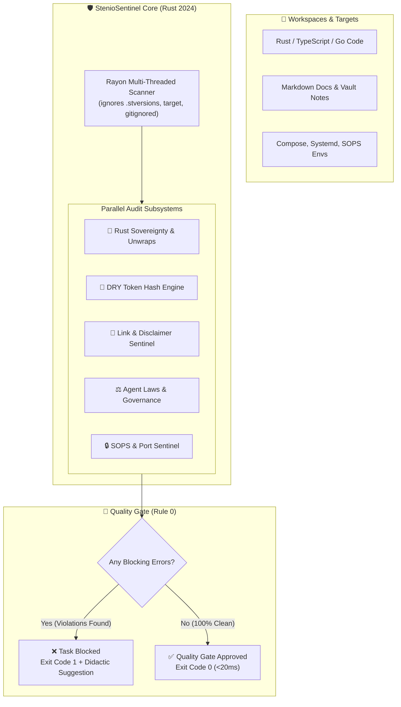

# 🛡️ StenioSentinel (v3.1.0) — High-Performance AI Governance Engine in Rust

[](https://github.com/ceduardorodrig/STENIO-SENTINEL)
[](https://www.rust-lang.org)
[](LICENSE-MIT)
[](https://github.com/ceduardorodrig/STENIO-SENTINEL)
[](https://github.com/ceduardorodrig/STENIO-SENTINEL)

> **"Sub-millisecond static governance engine, anti-bypass quality gate, and architectural integrity sentinel for AI coding agents written in Rust 2024."**

---

## 📑 Table of Contents

- 🎯 [Overview & Purpose](#-overview--purpose)
- 🧠 [The AI Coding Problem (Why StenioSentinel?)](#-the-ai-coding-problem-why-steniosentinel)
- ⚡ [Key Capabilities](#-key-capabilities)
- 📐 [Architecture Diagram](#-architecture-diagram)
- 🚀 [Installation & Quick Start](#-installation--quick-start)
- 🛠️ [CLI Command Reference](#️-cli-command-reference)
- 🔍 [Built-in Rule Catalog & Scopes](#-built-in-rule-catalog--scopes)
- 📜 [License](#-license)
- 📬 [Author & Community](#-author--community)

---

## 🎯 Overview & Purpose

**StenioSentinel** is a deterministic, ultra-fast static analysis engine and architectural governance sentinel developed in pure **Rust 2024**. 

Built to pair with autonomous AI agents (Claude Code, Gemini CLI, Cursor, Codex, OpenCode, and local LLMs), StenioSentinel acts as an unyielding **Quality Gate (Rule 0)**. It enforces architectural sovereignty, catches silent bypasses, validates documentation integrity, prevents runtime panic risks, and eliminates code duplication — scanning thousands of files in under **10 to 200 milliseconds**.

---

## 🧠 The AI Coding Problem (Why StenioSentinel?)

While autonomous AI agents accelerate software development, they exhibit predictable structural failure modes:

| Autonomous AI Failure Mode | Real-World Impact | How StenioSentinel Solves It |
|---|---|---|
| **Goodhart's Law & Bypasses** | Agent masks type errors with `// @ts-ignore`, `# type: ignore`, or `--no-verify`. | **Zero Suppression Tolerance:** Strictly flags and fails any suppression comments or git hook bypasses (`SEC-NO-BYPASS`). |
| **Panic in Production** | Agent swaps `.unwrap()` for `.expect()` to silence the compiler, causing thread panics in production. | **Fatal Error on Unsafe Unwraps (`RUST-NO-UNWRAP`):** Blocks all unhandled `.unwrap()` / `.expect()` calls in production Rust. |
| **Sycophancy & Blind Delivery** | Agent declares tasks "Complete!" while leaving broken links or failing tests. | **Rule 0 Quality Gate:** Tasks are physically not ready until `stenio` returns exit code 0. |
| **Silent Code Duplication** | Agent re-implements utility functions across multiple files instead of refactoring. | **Zero Duplication (DRY Engine):** Multi-line sliding window token hashing detects and blocks duplicated code blocks. |
| **Documentation Rot** | Code evolves but docs and service catalogs point to dead files or broken anchors. | **Docs-as-Code Crawler:** Validates relative markdown links, tag taxonomies, and service references. |

---

## ⚡ Key Capabilities

### 1. Sub-Millisecond Multi-Threaded Engine
Leveraging Rayon and the memory-mapped `ignore` walker, StenioSentinel traverses directories concurrently while honoring `.gitignore` and Syncthing `.stignore` rules. Full audits complete in **1ms to 200ms**.

### 2. Mandatory Quality Gate & Anti-Bypass
Rule 0 enforces that no AI agent can claim task completion without passing Stênio's static verification. Unhandled unwraps, skipped tests, and suppressed linter flags are treated as critical blocking failures.

### 3. Interactive Didactic Remediation (`--explain`)
Whenever a rule violation occurs, agents and developers can execute:
```bash
stenio --explain <RULE_ID>
```
Stênio prints the rule's rationale, bad code examples, good code examples, and the exact remediation recipe.

### 4. Surgical Auto-Fixing (`--fix`)
Fixes common formatting issues, tag discrepancies, and syntax divergences atomically on disk without manual intervention.

### 5. Tailscale Mesh & Homelab Observability (`--mesh`, `--health`)
Performs concurrent asynchronous socket probes across distributed infrastructure nodes (Tailscale / WireGuard) in under **30ms to 100ms**, delivering instant health telemetry of NVMe storage, RAM, and GPU accelerators (NVIDIA RTX).

---

## 📐 Architecture Diagram



---

## 🚀 Installation & Quick Start

### Build from Source (Cargo)

Ensure you have Rust 1.85+ installed (Rust 2024 edition compatible):

```bash
# Clone the repository
git clone https://github.com/ceduardorodrig/STENIO-SENTINEL.git
cd STENIO-SENTINEL

# Build optimized release binary
cargo build --release

# Install to user PATH
cp target/release/stenio ~/.cargo/bin/
```

### Quick Run

```bash
# Run contextual audit on current directory
stenio

# Audit specific directory or repository
stenio --path /path/to/project

# Run git diff staged audit (pre-commit hook)
stenio --diff

# Explain any rule
stenio --explain DOC-VIBE-DISCLAIMER
```

---

## 🛠️ CLI Command Reference

```text
StenioSentinel v3.1.0 — Universal AI Governance & Static Sentinel

Usage: stenio [OPTIONS]

Options:
      --path <PATH>          Target directory to scan [default: .]
      --scope <SCOPE>        Audit scope: [hub, homelab, vault, doc, cv, all]
      --rule <RULE_ID>       Execute only a specific rule by ID
      --diff [<REF>]         Audit only files modified relative to git ref (e.g., HEAD~1 or staged)
      --fix                  Apply automatic surgical repairs to violations
      --fast                 Fast mode (skip deep cross-linking and token hash checks)
      --clean                Sanitize debug artifacts, leftover test files, and reclaim disk
      --mesh                 Concurrent socket probe across Tailscale network nodes
      --health               Full-spectrum system diagnostic (NVMe, RAM, GPU, services)
      --typegen              Generate TypeScript types from Rust DTO structs
      --explain <RULE_ID>    Explain why a rule exists with bad/good examples
      --self-test            Run built-in synthetic rule integrity tests
  -h, --help                 Print help
  -V, --version              Print version
```

---

## 🔍 Built-in Rule Catalog & Scopes

| Rule ID | Category | Severity | Description |
|---|:---:|:---:|---|
| `RUST-NO-UNWRAP` | Rust | **ERROR** | Strictly forbids `.unwrap()` and `.expect()` in production code. |
| `ARCH-NO-PYTHON` | Arch | **ERROR** | Enforces 100% native Rust backend sovereignty (ADR-036). |
| `ARCH-DRY-DUPLICATION` | Code | **ERROR** | Blocks identical multi-line logic blocks duplicated across files. |
| `DOC-VIBE-DISCLAIMER` | Docs | **WARN** | Enforces the standardized human-AI governance disclaimer in public READMEs. |
| `SEC-SECRETS` | Security | **ERROR** | Blocks plain-text API keys, GitHub tokens, and private keys. |
| `SEC-SOPS-UNENCRYPTED` | Security | **ERROR** | Prevents committing unencrypted environment files (`.enc.env`). |
| `GOV-AGENT-LAWS` | Gov | **ERROR** | Validates agent constitution and governance rules in `AGENTS.md`. |
| `VAULT-TAG-TAXONOMY` | Docs | **WARN** | Restricts tags to canonical taxomony cataloged in `_tags.md`. |

---

## 📜 License

Dual-licensed under either:

- **MIT License** ([LICENSE-MIT](LICENSE-MIT))
- **Apache License, Version 2.0** ([LICENSE-APACHE](LICENSE-APACHE))

at your option.

---

## 📬 Author & Community

- **Creator & Maintainer:** **Carlos Eduardo Rodrigues** ([@ceduardorodrig](https://github.com/ceduardorodrig))
- **Portfolio & Curriculum:** [CURRICULUM-VITAE](https://github.com/ceduardorodrig/CURRICULUM-VITAE)
- **Venture:** [Sumænimá](https://sumaenima.chimaera-heptatonic.ts.net)

---

<div align="center">

> **Yes... This is a Vibe Coded project**
>
> Governed by 🤖 **StenioSentinel** (our Rust-based AI Governance Sentinel) with **Carlos Eduardo Rodrigues** ([@ceduardorodrig](https://github.com/ceduardorodrig)).

</div>
